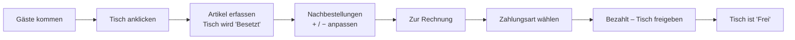

# Smart Restaurant – Benutzerhandbuch

Dieses Handbuch richtet sich an das Service-Personal und erklärt die Bedienung der **Tischverwaltung**. Technische Details stehen in der [Entwicklerdokumentation](./Entwicklerdokumentation.md).

---

## 1. Anwendung öffnen

Öffnen Sie im Browser die Adresse, die Ihnen die Betreuung des Systems genannt hat – bei einer lokalen Installation **http://localhost:5173**.

Beim Start werden Tische, Speisekarte und Mitarbeiter geladen. Solange erscheint der Hinweis **„Lädt…“**.

> Erscheint stattdessen **„Backend nicht erreichbar“**, ist der Server nicht gestartet oder nicht erreichbar. Klicken Sie nach Behebung auf **„Erneut versuchen“** (siehe [Abschnitt 7](#7-häufige-fragen--probleme)).

---

## 2. Die Oberfläche im Überblick

```
┌───────────────────────────────────────────────────────────────────────────┐
│ SERVICE  Tischverwaltung             Gesamt 12  Besetzt 3  Frei 9   ◑/☀   │  ← Kopfzeile
├──────────────────────────────────────────────┬────────────────────────────┤
│  ┌────┐ ┌────┐ ┌────┐ ┌────┐                 │  Tisch 4               ×   │
│  │ 1  │ │ 2  │ │ 3  │ │ 4  │                 │  [ Frei ] [ Besetzt ]      │
│  │frei│ │frei│ │bes.│ │bes.│                 │  BESTELLUNG | RECHNUNG     │
│  └────┘ └────┘ └────┘ └────┘                 │  (Essen) (Trinken)         │
│  ┌────┐ ┌────┐ ...                           │  Wiener Schnitzel    [+]   │
│  │ 5  │ │ 6  │                               │  ...                       │
│  └────┘ └────┘                               │  Zwischensumme  37,80 €    │
│                                              │  [ Zur Rechnung → ]        │
│            Tischübersicht                    │     Seitenleiste           │
└──────────────────────────────────────────────┴────────────────────────────┘
```

### 2.1 Kopfzeile

| Element           | Bedeutung                                                                    |
| ----------------- | ---------------------------------------------------------------------------- |
| **Gesamt**  | Anzahl aller Tische                                                          |
| **Besetzt** | Anzahl der aktuell besetzten Tische (hervorgehoben)                          |
| **Frei**    | Anzahl der freien Tische                                                     |
| **◑ / ☀** | Umschalten zwischen hellem und dunklem Design (◑ = zu Dunkel, ☀ = zu Hell) |

### 2.2 Tischübersicht

Jeder Tisch wird als Karte angezeigt:

- **Große Zahl** – Tischnummer
- **Farbiger Balken oben / Statustext**
  - **Grün – FREI**: Tisch ist verfügbar
  - **Orange – BESETZT**: Tisch ist belegt
- **„x Pos. · Betrag“** – erscheint, sobald für den Tisch Artikel erfasst wurden (Anzahl der Artikel und aktuelle Summe)

Ein Klick auf eine Karte öffnet rechts die **Seitenleiste** für diesen Tisch. Der ausgewählte Tisch ist orange umrandet.

---

## 3. Tischstatus ändern

In der Seitenleiste oben befinden sich die Schaltflächen **Frei** und **Besetzt**.

- **Besetzt** – markiert den Tisch als belegt, z. B. wenn Gäste Platz nehmen.
- **Frei** – gibt den Tisch frei.

> **Achtung:** Beim Klick auf **Frei** wird eine noch nicht bezahlte Bestellung dieses Tisches **ohne Rückfrage verworfen**. Nutzen Sie für den normalen Abschluss immer den Bezahlvorgang ([Abschnitt 5](#5-rechnung-und-bezahlen)).

Sobald Sie den ersten Artikel für einen freien Tisch erfassen, wird er automatisch auf **Besetzt** gesetzt.

---

## 4. Bestellung aufnehmen

1. Tisch in der Übersicht anklicken.
2. In der Seitenleiste ist der Reiter **BESTELLUNG** geöffnet.
3. Oben die gewünschte **Kategorie** wählen (z. B. **Essen** oder **Trinken**).
4. Auf einen **Artikel** tippen, um ihn einmal hinzuzufügen. Bereits bestellte Artikel sind farblich hervorgehoben und zeigen die Menge.
5. Menge anpassen:
   - **+** erhöht die Menge um 1
   - **−** verringert die Menge um 1; bei Menge 0 wird der Artikel aus der Bestellung entfernt
6. Unten wird laufend die **Zwischensumme** angezeigt.
7. Mit **„Zur Rechnung →“** wechseln Sie zum Reiter **RECHNUNG**.

Mit **×** oben rechts schließen Sie die Seitenleiste. Die erfasste Bestellung bleibt am Tisch erhalten, solange die Seite nicht neu geladen wird.

---

## 5. Rechnung und Bezahlen

Im Reiter **RECHNUNG** sehen Sie:

- alle bestellten Artikel mit Menge, Einzelpreis und Positionssumme (Mengen lassen sich hier ebenfalls mit **+ / −** korrigieren),
- **Netto**, **MwSt. 19 %** und den **Gesamtbetrag**.

Bezahlen:

1. **Zahlungsart** wählen: **💵 Bar** oder **💳 Karte**.
2. Auf **„Bezahlt (Bar/Karte) — Tisch freigeben“** klicken. Solange keine Zahlungsart gewählt ist, zeigt die Schaltfläche „Zahlungsart wählen“ und ist gesperrt.
3. Während der Verarbeitung erscheint **„Wird verarbeitet…“**.
4. Nach erfolgreicher Zahlung
   - wird die Bestellung im System gespeichert und als **bezahlt** vermerkt,
   - wird der Tisch automatisch auf **Frei** gesetzt,
   - schließt sich die Seitenleiste.

Schlägt die Zahlung fehl, erscheint unter der Schaltfläche ein orangefarbener Hinweis mit der Fehlermeldung. Die Bestellung bleibt dann erhalten und kann erneut abgeschlossen werden.

Ist noch nichts bestellt, zeigt der Reiter **„Keine Bestellung vorhanden“**.

---

## 6. Typischer Ablauf



---

## 7. Häufige Fragen / Probleme

| Problem                                                                             | Ursache / Lösung                                                                                                                                                                                                                        |
| ----------------------------------------------------------------------------------- | ---------------------------------------------------------------------------------------------------------------------------------------------------------------------------------------------------------------------------------------- |
| **„Backend nicht erreichbar“** beim Start                                   | Der Server läuft nicht oder die Verbindung ist gestört. Betreuung informieren bzw. Server starten, dann**„Erneut versuchen“** klicken.                                                                                         |
| Nach dem Neuladen der Seite ist die Bestellung weg, der Tisch aber noch „Besetzt“ | Nicht bezahlte Bestellungen werden erst beim Bezahlen gespeichert. Bestellung neu erfassen oder – falls die Gäste gegangen sind – Tisch mit**Frei** freigeben. **Seite während des Service möglichst nicht neu laden.** |
| Fehlermeldung beim Bezahlen, z. B. „Keine Mitarbeiter im Backend gefunden“        | Im System sind keine Mitarbeiter hinterlegt. Betreuung informieren.                                                                                                                                                                      |
| Ein Artikel fehlt in der Speisekarte                                                | Die Speisekarte wird zentral im System gepflegt. Betreuung informieren; nach der Änderung Seite neu laden (vorher offene Tische abrechnen).                                                                                             |
| Zu viel erfasst                                                                     | Mit**−** reduzieren, bis der Artikel verschwindet.                                                                                                                                                                                |
| Schrift/Kontrast schlecht lesbar                                                    | Über**◑ / ☀** in der Kopfzeile auf helles bzw. dunkles Design wechseln.                                                                                                                                                         |

---

## 8. Hinweise

- Es gibt derzeit **keine Anmeldung**; alle Geräte arbeiten mit denselben Daten.
- Die Zahlungsart (Bar/Karte) dient nur der Anzeige und wird nicht gespeichert.
- Mehrere Geräte gleichzeitig: Der Tischstatus wird gespeichert, die noch offene Bestellung eines Tisches ist jedoch nur auf dem Gerät sichtbar, auf dem sie erfasst wurde.
