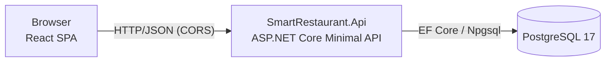
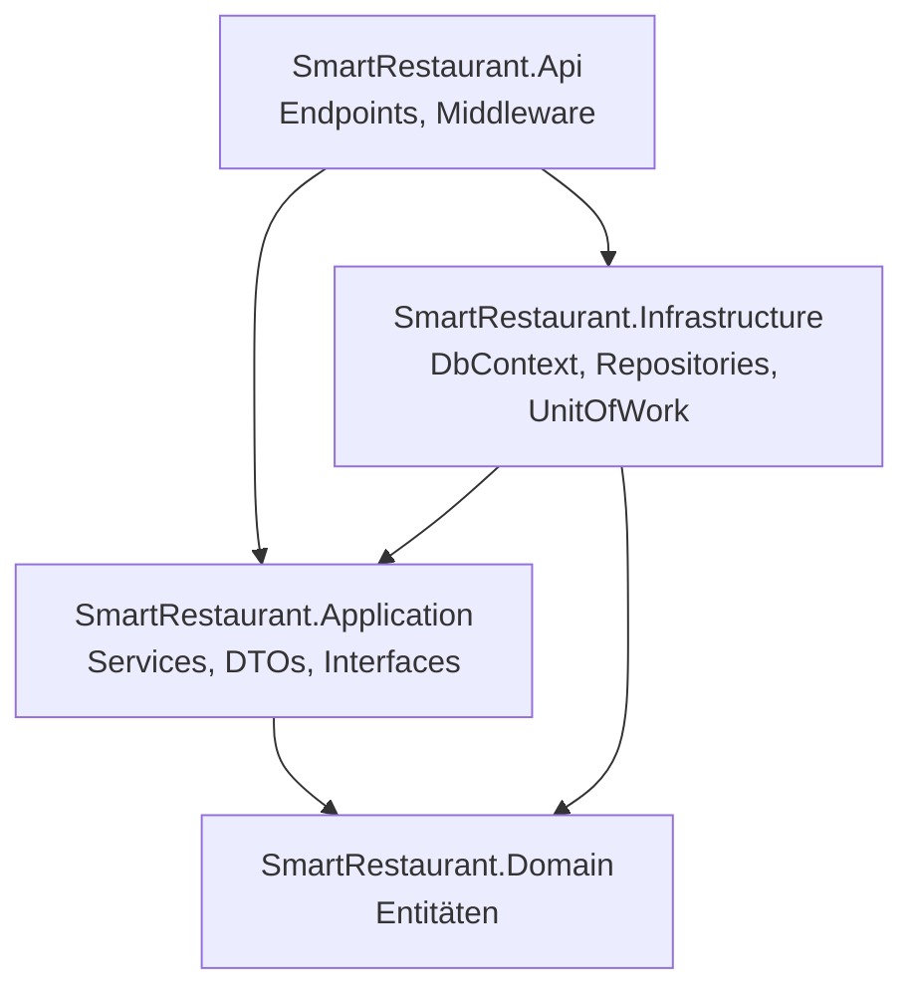
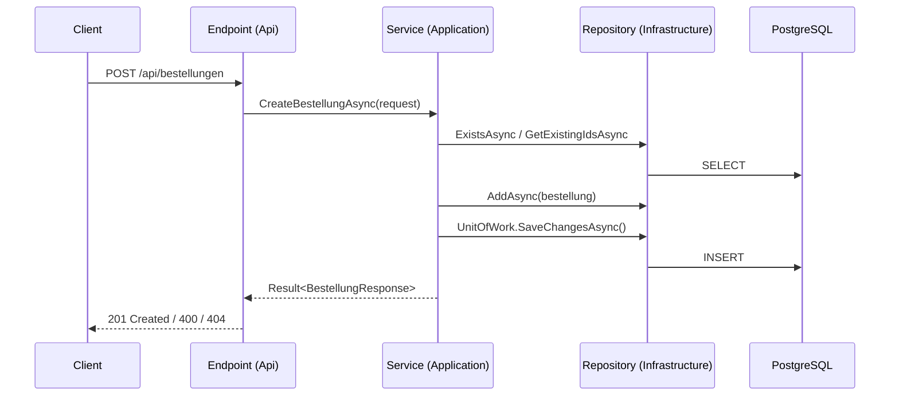
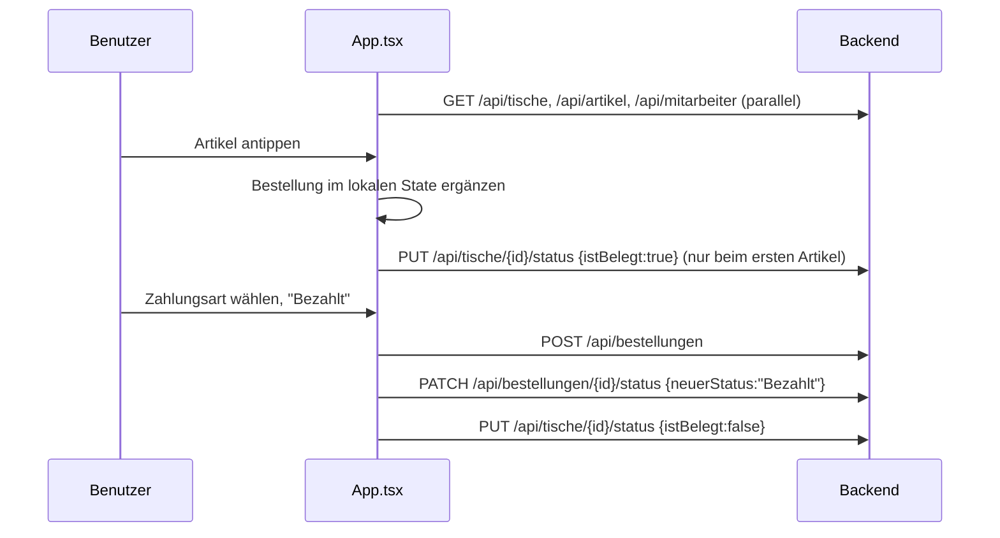

# Smart Restaurant – Entwicklerdokumentation

Diese Dokumentation beschreibt Aufbau, Technologien, lokale Einrichtung und Erweiterung des Smart-Restaurant-Systems.
Die fachliche Bedienung ist im [Benutzerhandbuch](./Benutzerhandbuch.md) beschrieben, die REST-Schnittstelle im Detail in [API.md](./API.md) und [JSONFORMAT.md](./JSONFORMAT.md).

---

## 1. Systemüberblick

Smart Restaurant ist eine Tischverwaltung für den Service: Tische werden als frei/besetzt geführt, Bestellungen erfasst, Rechnungen erstellt und bezahlt. Zusätzlich stellt das Backend Speisekarte, Lagerbestand und Mitarbeiter-Stammdaten bereit.



| Komponente | Technologie                                             | Ordner        | Port (lokal)              |
| ---------- | ------------------------------------------------------- | ------------- | ------------------------- |
| Frontend   | React 19, TypeScript 6, Vite 8, Tailwind CSS 4          | `Frontend/` | 5173                      |
| Backend    | .NET 10, ASP.NET Core Minimal APIs, EF Core 10 (Npgsql) | `Backend/`  | 5027 (HTTP), 7035 (HTTPS) |
| Datenbank  | PostgreSQL 17                                           | `Database/` | 5432                      |
| Doku       | Markdown, draw.io                                       | `Docs/`     | –                        |

### 1.1 Repository-Struktur

```
docker-compose.yaml         Startet DB, API und Frontend gemeinsam
Backend/
  SmartRestaurant.slnx      Solution (neues XML-Format, .NET SDK ≥ 9.0.200)
  src/
    SmartRestaurant.Domain/          Entitäten (keine Abhängigkeiten)
    SmartRestaurant.Application/     Services, DTOs, Interfaces, Result-Typ
    SmartRestaurant.Infrastructure/  EF Core DbContext, Konfigurationen, Repositories
    SmartRestaurant.Api/             Minimal-API-Endpunkte, Middleware, Program.cs
  tests/
    SmartRestaurant.Application.Tests/  xUnit + Moq Unit-Tests der Services
Database/
  schema.sql                Tabellendefinitionen
  data.sql                  Startdaten (Tische, Artikel, Mitarbeiter)
Docs/
  API.md, JSONFORMAT.md     Schnittstellenbeschreibung
  Smart_Restaurant_ERM.drawio, Building_block_view.drawio
Frontend/
  src/                      React-Anwendung
```

---

## 2. Schnellstart

### 2.1 Voraussetzungen

- [Docker Desktop](https://www.docker.com/products/docker-desktop/) (für Variante A und die Datenbank in Variante B)
- [.NET SDK 10](https://dotnet.microsoft.com/download) (nur Variante B)
- [Node.js 22](https://nodejs.org/) inkl. npm (nur Variante B)

### 2.2 Variante A – alles mit Docker Compose

```powershell
docker compose up --build
```

| Dienst                | URL                          |
| --------------------- | ---------------------------- |
| Frontend              | http://localhost:5173        |
| API                   | http://localhost:5027        |
| API-Referenz (Scalar) | http://localhost:5027/scalar |
| Health Check          | http://localhost:5027/health |

> `schema.sql` und `data.sql` werden nur beim **ersten** Start mit leerem Volume ausgeführt. Um die Datenbank neu aufzusetzen: `docker compose down -v` und erneut starten (löscht alle Daten!).

### 2.3 Variante B – lokale Entwicklung

1. **Datenbank** im Container starten:
   ```powershell
   docker compose up db
   ```
2. **Backend** starten (verwendet den Connection String aus `appsettings.Development.json`):
   ```powershell
   cd Backend
   dotnet run --project src/SmartRestaurant.Api
   ```
3. **Frontend** starten:
   ```powershell
   cd Frontend
   npm install
   npm run dev
   ```

### 2.4 Tests ausführen

```powershell
cd Backend
dotnet test
```

---

## 3. Backend

### 3.1 Architektur (Clean Architecture)



- **Domain** – reine Entitätsklassen (`Artikel`, `Bestellung`, `Bestellposition`, `StatusLog`, `Tisch`, `Mitarbeiter`, `Zutat`, `ArtikelZutat`, `Lagerbestand`).
- **Application** – Geschäftslogik in Services (`BestellungService`, `ArtikelService`, `LagerService`, `StammdatenService`). Definiert die Repository-Interfaces (`Interfaces/Persistence`) und Service-Interfaces (`Interfaces/Services`). Kennt weder EF Core noch HTTP.
- **Infrastructure** – implementiert die Repository-Interfaces mit EF Core; `UnitOfWork` kapselt `SaveChangesAsync`. Tabellen-/Spalten-Mapping in `Persistence/Configurations/*Configuration.cs`.
- **Api** – Minimal-API-Endpunkte je Fachbereich, OpenAPI/Scalar, CORS, globales Exception-Handling, Health Check.

Registrierung der Abhängigkeiten:

- [Application/DependencyInjection.cs](../Backend/src/SmartRestaurant.Application/DependencyInjection.cs) – `AddApplication()`
- [Infrastructure/DependencyInjection.cs](../Backend/src/SmartRestaurant.Infrastructure/DependencyInjection.cs) – `AddInfrastructure(configuration)`

### 3.2 Request-Ablauf



### 3.3 Fehlerbehandlung

- Services liefern fachliche Fehler als `Result<T>` ([Result.cs](../Backend/src/SmartRestaurant.Application/Common/Result.cs)) mit `ErrorType` (`Validation`, `NotFound`).
- [ResultExtensions.cs](../Backend/src/SmartRestaurant.Api/Endpoints/ResultExtensions.cs) übersetzt diese in HTTP-Antworten:
  - `Validation` → `400` mit `{ "message": "..." }`
  - `NotFound` → `404` mit `{ "message": "..." }`
- Unerwartete Exceptions fängt der [GlobalExceptionHandler](../Backend/src/SmartRestaurant.Api/Middleware/GlobalExceptionHandler.cs) ab und liefert `500` als `ProblemDetails` (Stacktrace im Feld `detail` nur im Development-Modus).

### 3.4 Endpunkte

| Methode | Pfad                              | Datei                                                                                        |
| ------- | --------------------------------- | -------------------------------------------------------------------------------------------- |
| POST    | `/api/bestellungen`             | [BestellungEndpoints.cs](../Backend/src/SmartRestaurant.Api/Endpoints/BestellungEndpoints.cs) |
| GET     | `/api/bestellungen/{id}`        | BestellungEndpoints.cs                                                                       |
| PATCH   | `/api/bestellungen/{id}/status` | BestellungEndpoints.cs                                                                       |
| GET     | `/api/artikel`                  | [ArtikelEndpoints.cs](../Backend/src/SmartRestaurant.Api/Endpoints/ArtikelEndpoints.cs)       |
| GET     | `/api/lager`                    | [LagerEndpoints.cs](../Backend/src/SmartRestaurant.Api/Endpoints/LagerEndpoints.cs)           |
| PUT     | `/api/lager/{zutatenId}`        | LagerEndpoints.cs                                                                            |
| GET     | `/api/tische`                   | [StammdatenEndpoints.cs](../Backend/src/SmartRestaurant.Api/Endpoints/StammdatenEndpoints.cs) |
| PUT     | `/api/tische/{id}/status`       | StammdatenEndpoints.cs                                                                       |
| GET     | `/api/mitarbeiter`              | StammdatenEndpoints.cs                                                                       |
| GET     | `/health`                       | [Program.cs](../Backend/src/SmartRestaurant.Api/Program.cs)                                   |

Request-/Response-Formate: siehe [API.md](./API.md). Im Development-Modus ist unter `/scalar` eine interaktive Referenz verfügbar, das OpenAPI-Dokument unter `/openapi/v1.json`. Beispielaufrufe stehen in [SmartRestaurant.Api.http](../Backend/src/SmartRestaurant.Api/SmartRestaurant.Api.http).

### 3.5 Konfiguration

| Einstellung                           | Ort                                                                                            | Hinweis                                                                                                                                                        |
| ------------------------------------- | ---------------------------------------------------------------------------------------------- | -------------------------------------------------------------------------------------------------------------------------------------------------------------- |
| `ConnectionStrings:SmartRestaurant` | `appsettings.Development.json` bzw. Umgebungsvariable `ConnectionStrings__SmartRestaurant` | Pflicht; fehlt er, bricht der Start mit`InvalidOperationException` ab. In `appsettings.json` (Production) ist **kein** Connection String hinterlegt. |
| `ASPNETCORE_ENVIRONMENT`            | `launchSettings.json` / docker-compose                                                       | `Development` aktiviert Scalar/OpenAPI und Stacktraces in Fehlerantworten.                                                                                   |
| CORS-Origins                          | `Program.cs`                                                                                 | Erlaubt`http://localhost:5173` und `http://localhost:4173`. Bei anderen Frontend-URLs hier ergänzen.                                                      |

> Die Zugangsdaten `postgres/postgres` sind ausschließlich für die lokale Entwicklung gedacht. Für produktive Umgebungen Secrets über Umgebungsvariablen oder einen Secret Store setzen.

### 3.6 Neuen Endpunkt hinzufügen (Vorgehen)

1. Ggf. Entität in `Domain/Entities` anlegen und in `Infrastructure/Persistence/Configurations` mappen (`IEntityTypeConfiguration<T>`, wird automatisch über `ApplyConfigurationsFromAssembly` registriert) sowie `DbSet` im `SmartRestaurantDbContext` ergänzen.
2. Tabelle in `Database/schema.sql` ergänzen (es gibt **keine** EF-Migrations – das Schema wird per SQL-Skript verwaltet).
3. Repository-Interface in `Application/Interfaces/Persistence`, Implementierung in `Infrastructure/Repositories`, Registrierung in `AddInfrastructure`.
4. DTOs in `Application/Dtos`, Service-Interface + Service in `Application`, Registrierung in `AddApplication`. Fachliche Fehler als `Result<T>.Failure(...)` zurückgeben.
5. Endpunkt-Klasse in `Api/Endpoints` mit `Map...Endpoints()`-Extension, in `ServiceEndpoints.CreateEndpoints()` einhängen; `.WithName/.WithTags/.WithSummary/.Produces` für OpenAPI setzen.
6. Unit-Tests in `tests/SmartRestaurant.Application.Tests/Services` (xUnit + Moq, Repositories werden gemockt).
7. [API.md](./API.md) aktualisieren.

### 3.7 Tests

Die Tests in `Backend/tests/SmartRestaurant.Application.Tests` prüfen die Services isoliert (Repositories und `IUnitOfWork` als Moq-Mocks). Namenskonvention: `Methode_ErwartetesVerhalten_Bedingung`, z. B. `UpdateLagerbestandAsync_GibtNotFoundZurueck_WennZutatFehlt`. Integrationstests gegen eine echte Datenbank oder Endpunkt-Tests existieren derzeit nicht.

---

## 4. Datenbank

Das Schema liegt in [schema.sql](../Database/schema.sql), Startdaten in [data.sql](../Database/data.sql). Das ERM ist zusätzlich in [Smart_Restaurant_ERM.drawio](./Smart_Restaurant_ERM.drawio) modelliert.

```mermaid
erDiagram
    tisch ||--o{ bestellung : "hat"
    bestellung ||--o{ bestellposition : "enthält"
    artikel ||--o{ bestellposition : "wird bestellt in"
    bestellung ||--o{ status_log : "Historie"
    mitarbeiter ||--o{ status_log : "ändert"
    artikel ||--o{ artikel_zutaten : "benötigt"
    zutaten ||--o{ artikel_zutaten : "wird verwendet in"
    zutaten ||--o{ lager : "Bestand"

    tisch { int tisch_id PK; int plaetze; bool status }
    bestellung { int bestellung_id PK; int tisch_id FK; varchar status; timestamp zeitpunkt }
    bestellposition { int bestellposition_id PK; int bestellung_id FK; int artikel_id FK; int menge }
    artikel { int artikel_id PK; varchar name; numeric preis; varchar kategorie }
    status_log { int status_log_id PK; int bestellung_id FK; int mitarbeiter_id FK; varchar status; timestamp zeitpunkt }
    mitarbeiter { int mitarbeiter_id PK; varchar name; varchar benutzername; varchar rolle }
    zutaten { int zutaten_id PK; varchar zutaten_name }
    artikel_zutaten { int artikel_id PK; int zutaten_id PK; int menge }
    lager { int zutaten_lager_id PK; int zutaten_id FK; int soll; int ist }
```

Besonderheiten:

- `tisch.status` ist ein Boolean (`true` = belegt) und wird in der API als `istBelegt` ausgegeben.
- Zeitstempel werden als `timestamp` (ohne Zeitzone) in **UTC** gespeichert.
- Startdaten: 12 Tische, 20 Artikel (Kategorien `Essen`, `Trinken`), 4 Mitarbeiter. Für `zutaten`, `artikel_zutaten` und `lager` sind **keine** Startdaten hinterlegt – `GET /api/lager` liefert daher zunächst eine leere Liste.

---

## 5. Frontend

### 5.1 Aufbau

```
src/
  main.tsx            Einstiegspunkt, rendert <App/>
  App.tsx             Zentrale Komponente: hält den gesamten State, lädt Daten, Bezahl-Logik
  api.ts              Fetch-Client für das Backend inkl. API-Typen
  types.ts            UI-Typen (Table, OrderItem, MenuItem, TableStatus, PanelTab)
  utils.ts            fmt() Preisformatierung, getTotal() Summenberechnung
  index.css           Globale Styles, CSS-Variablen für Hell/Dunkel-Theme
  components/
    header/           Header (Titel, Statistik), Stat
    tables/           TableGrid (Raster), TableCard (einzelner Tisch)
    sidepanel/        SidePanel, OrderTab (Speisekarte), BillTab (Rechnung & Bezahlen)
    buttons/          StatusBtn, QtyBtn, ThemeToggle
    modal/            BillModal (Rechnungs-Popup)
```

Styling erfolgt überwiegend über Inline-Styles mit CSS-Variablen (`var(--c-...)`), das Dark-Theme wird über die Klasse `dark` am Wurzelelement umgeschaltet.

### 5.2 Datenfluss



Wichtige Punkte:

- Die Bestellpositionen eines Tisches leben bis zur Zahlung **nur im React-State**. Erst beim Bezahlen wird die Bestellung angelegt und direkt auf `Bezahlt` gesetzt.
- Als Mitarbeiter für den Statuswechsel wird der erste Eintrag aus `GET /api/mitarbeiter` verwendet (es gibt keine Anmeldung).
- Der Tischstatus wird „best effort“ synchronisiert: Die UI ändert sich sofort, Fehler beim Speichern landen nur in der Browser-Konsole.

### 5.3 Konfiguration

| Variable              | Default                   | Hinweis                                                                                                                                            |
| --------------------- | ------------------------- | -------------------------------------------------------------------------------------------------------------------------------------------------- |
| `VITE_API_BASE_URL` | `http://localhost:5027` | Wird zur**Build-Zeit** eingebettet. Für abweichende Backend-URLs z. B. in `Frontend/.env.local` setzen oder beim Docker-Build übergeben. |

### 5.4 Skripte

| Befehl              | Zweck                                                      |
| ------------------- | ---------------------------------------------------------- |
| `npm run dev`     | Dev-Server mit Hot Reload (Port 5173)                      |
| `npm run build`   | Typprüfung (`tsc`) und Produktions-Build nach `dist/` |
| `npm run preview` | Lokale Vorschau des Builds (Port 4173)                     |

Der Docker-Build ([Frontend/Dockerfile](../Frontend/Dockerfile)) baut mit Node 22 und liefert `dist/` über nginx auf Port 80 aus.

---

## 6. Bekannte Einschränkungen / offene Punkte

| Thema                                | Beschreibung                                                                                                                                               |
| ------------------------------------ | ---------------------------------------------------------------------------------------------------------------------------------------------------------- |
| Offene Bestellungen nicht persistent | Nicht bezahlte Positionen gehen beim Neuladen der Seite verloren; der Tisch bleibt dabei als „besetzt“ markiert.                                         |
| Bestellstatus                        | Der Küchen-Workflow (`In Zubereitung`, `Servierbereit`) wird vom Frontend nicht genutzt. `neuerStatus` ist Freitext ohne serverseitige Validierung. |
| Zahlungsart                          | Bar/Karte wird nur in der UI ausgewählt, aber nicht gespeichert.                                                                                          |
| MwSt.-Berechnung                     | `BillTab` berechnet die MwSt. als 19 % des Bruttobetrags (`total * 0.19`). Korrekt bei Bruttopreisen wäre `total - total / 1.19`.                   |
| Preise                               | Positionspreise werden aus dem**aktuellen** Artikelpreis berechnet, nicht zum Bestellzeitpunkt eingefroren.                                          |
| Lager                                | Bestellungen reduzieren den Lagerbestand nicht automatisch; es gibt keine Startdaten für Zutaten/Lager.                                                   |
| Sicherheit                           | Keine Authentifizierung/Autorisierung; alle Endpunkte sind offen.                                                                                          |
| Ungenutzter Code                     | `BillModal` wird gerendert, wenn `showBill` true ist – `showBill` wird aktuell aber nirgends auf `true` gesetzt.                                  |
| Schema-Verwaltung                    | Keine EF-Migrations; Schemaänderungen müssen manuell in`schema.sql` gepflegt und die DB neu initialisiert werden.                                      |
